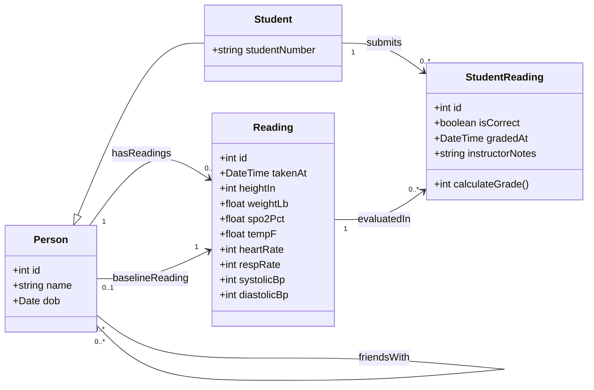

# GitVitals – Class Diagram (Mermaid)

```mermaid
classDiagram
direction LR

class Person {
  +int id
  +string name
  +Date dob
}

class Student {
  +string studentNumber
}

class Reading {
  +int id
  +DateTime takenAt
  +int heightIn
  +float weightLb
  +float spo2Pct
  +float tempF
  +int heartRate
  +int respRate
  +int systolicBp
  +int diastolicBp
}

class StudentReading {
  +int id
  +boolean isCorrect
  +DateTime gradedAt
  +string instructorNotes
  +int calculateGrade()
}

Person <|-- Student

Person "1" --> "0..*" Reading : hasReadings
Person "0..1" --> "1" Reading : baselineReading
Person "0..*" -- "0..*" Person : friendsWith

Student "1" --> "0..*" StudentReading : submits
Reading "1" --> "0..*" StudentReading : evaluatedIn

```
